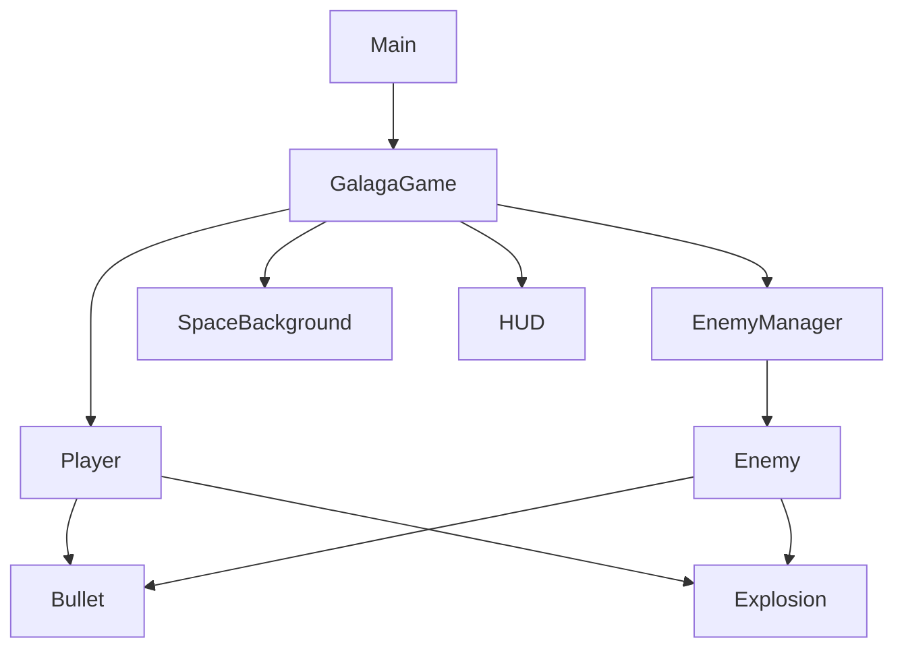
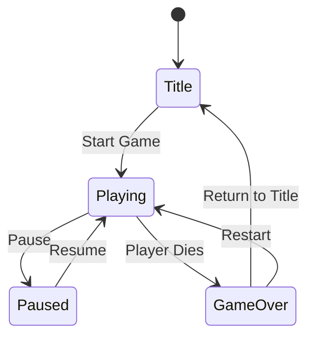
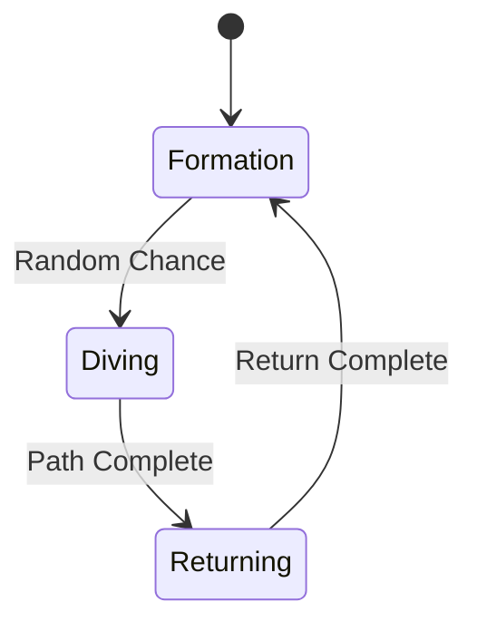

# Galaga Clone Specification

## Architecture

## Game States

## Enemy Behavior

## Components

- **GalagaGame**: Main game controller
- **Player**: Player-controlled ship with movement and shooting
- **Enemy**: Enemy ships with formation, diving and shooting behaviors
- **EnemyManager**: Manages spawning waves of enemies in formation
- **Bullet**: Projectiles fired by player and enemies
- **Explosion**: Animation displayed when entities are destroyed
- **SpaceBackground**: Parallax star field background
- **HUD**: Displays score, lives and game status

## Implementation Status

All components have been implemented:
- Game framework with Flame
- Player ship with movement and shooting
- Enemies with formation patterns and diving behavior
- Collision detection between bullets and game entities
- Score tracking and lives display
- Space background with parallax scrolling stars

## Assets Required

- Player ship sprite
- Enemy ship sprites (standard and boss)
- Bullet sprites
- Explosion animation frames
- Background elements (optional)
- Audio files for sound effects and music (optional)
